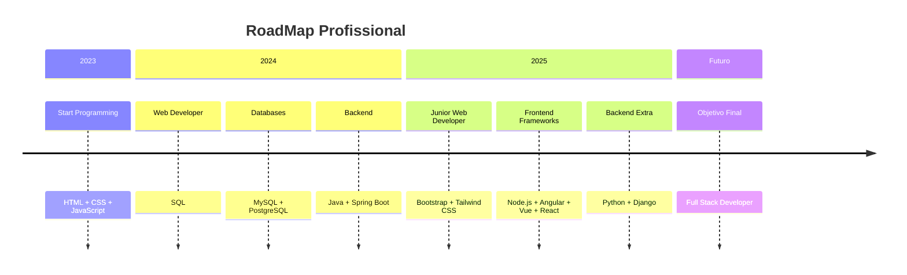

<div align="center">
  
</div>

<!-- Foto Principal -->
<div align="center">
  
  <br><br>
  
</div>

<div align="center">
  
  
  
</div>

---

<!-- GIF de Programador mais moderno -->


### About me

```javascript
const mauroDeLima = {
    location: " Angola",
    education: "Informatics Engineering",
    specialities: [
        "Web Development",
        "DataBase & SQL", 
        "Full Stack Development"
    ],
    passion: [
        "Solving Complex Problems",
        "Make scalable solutions",
        "I love Linux OS″,
        "Open Source"
    ],
    philosophy: "Code with purpose, learn continuously",
    goals: [
        "Contribute to Open Source projects",
        "Gain mastery in Microservices Architectures",
        "Deepen my understanding of Artificial Intelligence and Machine Learning"
    ],
    funFact: "Consumo mais café que água ",
    status: "Open to work with you! "
};
```

> *"Technology moves the world, but it's people who make the difference."*

---

##  Tech Stack

<div align="center">
  
</div>

<!-- GIF de tecnologias -->
<div align="center">
  
  
  
  
  
</div>

### **Backend Development**
<p align="left">
  
  
  
  
  
</p>

### **Frontend Development**
<p align="left">
  
  
  
  
</p>

### **Database & Cloud**
<p align="left">
  
  
  
</p>

<p align="center">
  
</p>

---

##  Highlighted Projects

<!-- GIF de projetos/desenvolvimento -->
<div align="center">
  
</div>

<div style="display: flex; overflow-x: auto; gap: 20px; padding: 20px; scroll-behavior: smooth; -webkit-overflow-scrolling: touch;">

<div style="flex-shrink: 0; width: 300px; border: 1px solid #30363d; border-radius: 10px; padding: 20px; background: #0d1117; box-shadow: 0 8px 16px rgba(0,0,0,0.3);">
<h3 align="center">📱 Do List</h3>
<div align="center">
  
  <br><br>
  <strong style="color: #58a6ff;">Modern and Responsive To-Do List</strong>
  <br><br>
  <p style="color: #8b949e; font-size: 14px;">
    ✓ Intuitive interface<br>
    ✓ Advanced features<br>
    ✓ Responsive design<br>
  </p>
  <p><strong style="color: #79c0ff;">Tech:</strong> React</p>
  <p>
    <a href="https://github.com/maurochelsio/AppToDo">
      
    </a>
  </p>
</div>
</div>

<div style="flex-shrink: 0; width: 300px; border: 1px solid #30363d; border-radius: 10px; padding: 20px; background: #0d1117; box-shadow: 0 8px 16px rgba(0,0,0,0.3);">
<h3 align="center">💾 Tuition Management</h3>
<div align="center">
  
  <br><br>
  <strong style="color: #58a6ff;">Tuition Management DB System</strong>
  <br><br>
  <p style="color: #8b949e; font-size: 14px;">
    🎯 Flexible & robust<br>
    📊 Automated queries<br>
    🔐 Secure system<br>
  </p>
  <p><strong style="color: #79c0ff;">Tech:</strong> SQL, MySQL, PostgreSQL</p>
  <p>
    <a href="https://github.com/maurochelsio/helpdesk-system">
      
    </a>
  </p>
</div>
</div>

<div style="flex-shrink: 0; width: 300px; border: 1px solid #30363d; border-radius: 10px; padding: 20px; background: #0d1117; box-shadow: 0 8px 16px rgba(0,0,0,0.3);">
<h3 align="center">🚀 MVP Project</h3>
<div align="center">
  
  <br><br>
  <strong style="color: #58a6ff;">Minimum Viable Product Development</strong>
  <br><br>
  <p style="color: #8b949e; font-size: 14px;">
    ⚡ Fast deployment<br>
    📈 Scalable architecture<br>
    🎯 Focused features<br>
  </p>
  <p><strong style="color: #79c0ff;">Tech:</strong> Full Stack Development</p>
  <p>
    <a href="#">
      
    </a>
  </p>
</div>
</div>

<div style="flex-shrink: 0; width: 300px; border: 1px solid #30363d; border-radius: 10px; padding: 20px; background: #0d1117; box-shadow: 0 8px 16px rgba(0,0,0,0.3);">
<h3 align="center">🛒 E-Commerce Platform</h3>
<div align="center">
  
  <br><br>
  <strong style="color: #58a6ff;">Complete E-Commerce Solution</strong>
  <br><br>
  <p style="color: #8b949e; font-size: 14px;">
    💳 Secure payments<br>
    📦 Product management<br>
    👥 User authentication<br>
  </p>
  <p><strong style="color: #79c0ff;">Tech:</strong> React, Node.js, PostgreSQL</p>
  <p>
    <a href="#">
      
    </a>
  </p>
</div>
</div>

</div>

---

##  My GitHub Statistics

<!-- GIF de estatísticas/análise -->
<div align="center">
  
</div>

<div align="center">
  
  
</div>

<div align="center">
  
</div>

<div align="center">
  
</div>

##  GitHub Achievements

<div align="center">
  
</div>

---

##  Currently Learning

<!-- GIF de aprendizado -->
<div align="center">
  
</div>

<div align="center">
  
  
  
  
</div>

---

##   Profissional Experience

<!-- GIF de trabalho/escritório -->
<p></p>

<div align="center">
  
</div>


## 📌 RoadMap Profissional  



---

##  Let's Connect!

<!-- GIF de conexão/rede -->
<div align="center">
  
</div>

<div align="center">
  <a href="https://www.linkedin.com/in/mauro-de-lima-1212712b1/">
    
  </a>
  <a href="mailto:maurochelsio@gmail.com">
    
  </a>
  <a href="https://twitter.com/maurochelsio" target="_blank">
    
  </a>
  <a href="https://wa.me/YOUR_WHATSAPP_NUMBER" target="_blank">
    
  </a>
</div>

---

##  Support My Work

<div align="center">
  
  <br>
  <p><em>"If you like my work, how about buying me a coffee?" ☕</em></p>
  <a href="https://buymeacoffee.com/maurochelsio" target="_blank">
    
  </a>
</div>

---

##  Latest Blog Posts


<!-- GIF de escrita/blog -->
<div align="center">
  
</div>

<!-- BLOG-POST-LIST:START -->
- [How to Build a REST API with Spring Boot](https://yourblog.com/api-spring-boot)
- [Java: Complete Guide for Beginners](https://yourblog.com/react-hooks-guide)
- [Microservices: Patterns and Practices](https://yourblog.com/microservices-patterns)
<!-- BLOG-POST-LIST:END -->

---

<div align="center">
  
</div>

---
<div align="center">
  
  <br>
  
  <!-- GIF de despedida -->
  
  
**💚 Made with love, dedication, and lots of coffee ☕**

*"Success is the sum of small efforts repeated day in and day out."*

 If you liked my work, consider giving a star to my repositories!

  
  
</div>
<br>
<div align="center">
  
</div>
